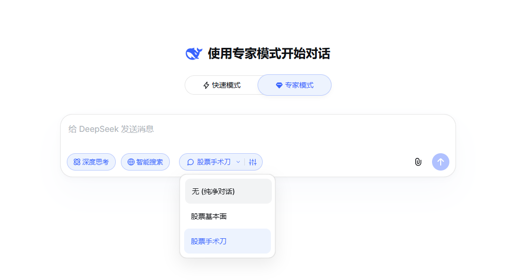
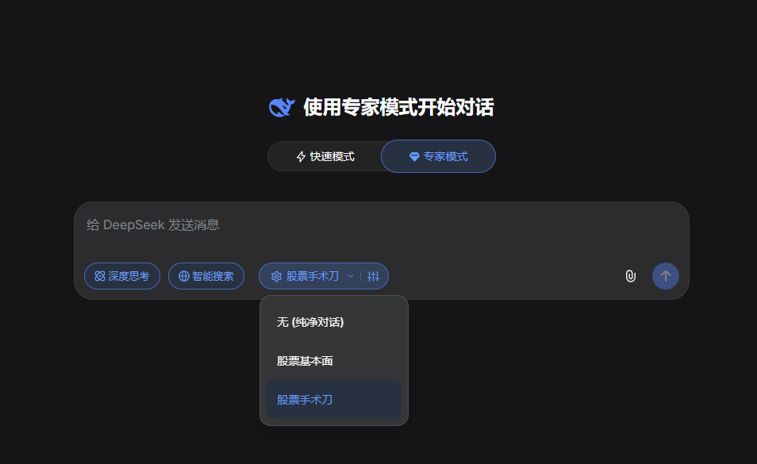

# 🧠 DeepSeek Custom Prompt Manager

**[简体中文](#chinese) · [English](#english) · [日本語](#japanese) · [Русский](#russian)**

## 🖼️ Screenshots / 截图预览

| | 主页 / Home | 偏好设置 / Preferences |
|:---:|:-----------:|:---------------------:|
| ☀️ 亮色 / Light |  |  |
| 🌙 暗色 / Dark |  |  |

---

## 🇨🇳 简体中文

### ✨ 项目背景

**DeepSeek V4 近期正式发布**，模型能力大幅跃升，用下来体验相当舒适流畅。然而在享受强大智能的同时，却发现网页端长期缺失一个关键能力——**自定义系统提示词（System Prompt）管理**。

反观 **Google Gemini** 和 **腾讯元宝**，它们便捷的指令预设体系令人印象深刻：你可以预设角色、规定输出格式、注入背景知识，让 AI 始终以最贴合你需求的方式回应。

既然 DeepSeek V4 的模型已经如此出色，怎能让提示词管理拖后腿？于是，**这个脚本诞生了**。✨

### 🚀 核心特性

#### 📚 多提示词指令库

- 创建并管理**任意数量**的自定义 System Prompt
- 每条指令支持独立命名，一眼识别，快速切换
- 内置**下拉快选菜单**，无需打开设置面板即可秒切指令

#### 🔌 无感网络注入

- 通过拦截 `XHR` 与 `fetch` 请求，在**发送前**将 System Prompt 无缝注入到每次对话
- 完全在本地运行，**不经过任何第三方服务器**，数据安全有保障
- 智能去重：同一提示词不会被重复注入

#### ⚡ 专家模式自动激活

- 一键开启"专家模式自动激活"：每次新建对话自动点亮 DeepSeek 的"专家模式"按钮
- 再也不用每次手动点击，省心省力

#### 🕐 动态实时时间注入

- 为每条指令单独开启"**动态时间注入**"开关
- 每次发送消息时，自动在 Prompt 末尾追加当前系统实时时间
- 让 AI 时刻感知"现在是几点"，适用于日程规划、市场分析等时间敏感场景

#### 🎨 原生融合 UI 设计

- 控件以 **Pill 胶囊组件**形式嵌入输入栏，与 DeepSeek 原生 UI 风格高度统一
- 支持 DeepSeek 的亮色 / 暗色主题，自动跟随，无需额外配置
- 丝滑的开关动画、悬浮卡片，精心打磨的交互细节

### 📦 安装方法

安装 **Tampermonkey**（推荐）或 **Violentmonkey**：

- [Tampermonkey for Chrome](https://www.tampermonkey.net/)
- [Tampermonkey for Firefox](https://addons.mozilla.org/firefox/addon/tampermonkey/)
- [Violentmonkey](https://violentmonkey.github.io/)

**步骤：**

1. 打开 Tampermonkey 扩展面板，点击「新建脚本」
2. 将 [`DeepSeekWeb_Custom_Prompt_Manager.js`](DeepSeekWeb_Custom_Prompt_Manager.js) 的完整内容复制粘贴进去
3. 按 `Ctrl+S` 保存
4. 打开 [chat.deepseek.com](https://chat.deepseek.com)，输入栏即可看到新增的胶囊控件 💊

### 🖥️ 使用指南

| 操作 | 说明 |
|------|------|
| 点击胶囊文字区域 | 打开快速切换下拉菜单，一键切换当前指令 |
| 点击胶囊右侧⚙️图标 | 打开完整偏好设置面板 |
| 新建指令 | 在面板中点击「新建」，填写标题和 System Prompt 内容 |
| 切换指令 | 从下拉菜单或面板列表中选择，立即生效 |
| 选择「无 (纯净对话)」 | 关闭所有提示词注入，还原 DeepSeek 原生体验 |
| 开启动态时间 | 在编辑指令时，打开「动态时间注入」开关 |

### 🛡️ 隐私声明

- 所有提示词数据均存储于本地浏览器的 `localStorage`，**不上传、不同步、不外传**
- 脚本仅在 `chat.deepseek.com` 域名下运行，权限最小化

---

## 🇬🇧 English

### ✨ Background

**DeepSeek V4 was recently released**, and it's been a genuinely great experience — the model is sharper, faster, and more capable than ever. But one thing noticeably missing from the web interface is **custom System Prompt management**.

Tools like **Google Gemini** and **Tencent Yuanbao** have nailed this — you can preset roles, define output formats, and inject background knowledge so the AI always responds exactly the way you want.

With DeepSeek V4 being this good, it deserves equally powerful prompt tooling. **So this script was born.** ✨

### 🚀 Key Features

#### 📚 Multi-Prompt Library

- Create and manage **unlimited** custom System Prompts
- Each prompt has its own name for instant recognition and quick switching
- Built-in **quick-select dropdown** — switch prompts without opening the settings panel

#### 🔌 Seamless Network Injection

- Intercepts `XHR` and `fetch` requests to silently inject your System Prompt **before each message is sent**
- Runs entirely locally — **no third-party servers involved**, your data stays private
- Smart deduplication: the same prompt is never injected twice

#### ⚡ Expert Mode Auto-Activation

- Toggle "Expert Mode Auto-Activation": automatically enables DeepSeek's "Expert Mode" on every new conversation
- No more clicking the button manually every time

#### 🕐 Dynamic Real-Time Timestamp Injection

- Enable the "**Dynamic Time Injection**" toggle per prompt
- Automatically appends the current system time to your prompt on every send
- Keeps the AI aware of real-world time — perfect for scheduling, market analysis, and time-sensitive tasks

#### 🎨 Native-Integrated UI

- Controls appear as a **pill widget** embedded in the input bar, seamlessly matching DeepSeek's native UI
- Automatically follows DeepSeek's light / dark theme — zero configuration needed
- Smooth animations and polished micro-interactions throughout

#### 🔄 Legacy Data Migration

- Upgrading from an older version? Your existing prompt data is **automatically migrated** with zero data loss

### 📦 Installation

Install **Tampermonkey** (recommended) or **Violentmonkey**:

- [Tampermonkey for Chrome](https://www.tampermonkey.net/)
- [Tampermonkey for Firefox](https://addons.mozilla.org/firefox/addon/tampermonkey/)
- [Violentmonkey](https://violentmonkey.github.io/)

**Steps:**

1. Open the Tampermonkey dashboard and click "Create a new script"
2. Copy and paste the full content of [`DeepSeekWeb_Custom_Prompt_Manager.js`](DeepSeekWeb_Custom_Prompt_Manager.js)
3. Press `Ctrl+S` to save
4. Navigate to [chat.deepseek.com](https://chat.deepseek.com) — the pill widget will appear in the input bar 💊

### 🖥️ Usage Guide

| Action | Description |
|--------|-------------|
| Click the pill text area | Opens the quick-select dropdown to switch prompts instantly |
| Click the ⚙️ icon on the right | Opens the full preferences panel |
| Create a new prompt | Click "New" in the panel, fill in a title and System Prompt content |
| Switch prompts | Select from the dropdown or panel list — takes effect immediately |
| Select "None (Clean chat)" | Disables all prompt injection, restoring the native DeepSeek experience |
| Enable dynamic time | Toggle "Dynamic Time Injection" when editing a prompt |

### 🛡️ Privacy

- All prompt data is stored in your browser's local `localStorage` — **never uploaded, synced, or shared**
- The script only runs on `chat.deepseek.com` with minimal permissions

---

## 🇯🇵 日本語

### ✨ プロジェクトの背景

**DeepSeek V4 が最近リリースされました**。モデルの能力は大幅に向上し、使い心地も非常に快適です。ところが、ウェブ版には長らく欠けている重要な機能があります――**カスタム System Prompt の管理**です。

**Google Gemini** や **Tencent Yuanbao（元宝）** を見ると、役割の事前設定、出力形式の指定、背景知識の注入など、細かくカスタマイズできる洗練されたプロンプト管理体験が備わっています。

DeepSeek V4 がこれほど優れているなら、プロンプト管理機能も同等に充実させるべきです。**そこでこのスクリプトが誕生しました。** ✨

### 🚀 主な機能

#### 📚 マルチプロンプトライブラリ

- **無制限**のカスタム System Prompt を作成・管理
- 各プロンプトに個別の名前を付けて一目で識別、素早く切り替え
- **クイック選択ドロップダウン**内蔵 — 設定パネルを開かずに即切り替え

#### 🔌 シームレスなネットワーク注入

- `XHR` と `fetch` リクエストを傍受し、**送信前**に System Prompt を静かに注入
- 完全ローカル動作 — **第三者サーバーは一切不使用**、プライバシーを守ります
- 重複防止機能：同じプロンプトが二重に注入されることはありません

#### ⚡ エキスパートモード自動有効化

- 「エキスパートモード自動有効化」をオンにすると、新しい会話を開始するたびに DeepSeek の「エキスパートモード」が自動的に有効になります
- 毎回手動でクリックする手間がなくなります

#### 🕐 動的タイムスタンプ注入

- プロンプトごとに「**動的時刻注入**」スイッチを個別設定
- メッセージ送信時に現在のシステム時刻を自動追記
- スケジュール管理や市場分析など、時間が重要なタスクに最適

#### 🎨 ネイティブ統合 UI

- **ピル型ウィジェット**として入力バーに埋め込まれ、DeepSeek のネイティブ UI と調和
- ライト / ダークテーマに自動対応 — 設定不要
- 滑らかなアニメーションと洗練されたインタラクション

#### 🔄 旧バージョンデータの自動移行

- 旧バージョンからのアップグレードでもデータは**自動的に移行**され、ゼロロス

### 📦 インストール方法

**Tampermonkey**（推奨）または **Violentmonkey** をインストール：

- [Tampermonkey for Chrome](https://www.tampermonkey.net/)
- [Tampermonkey for Firefox](https://addons.mozilla.org/firefox/addon/tampermonkey/)
- [Violentmonkey](https://violentmonkey.github.io/)

**手順：**

1. Tampermonkey ダッシュボードを開き、「新しいスクリプトを作成」をクリック
2. [`DeepSeekWeb_Custom_Prompt_Manager.js`](DeepSeekWeb_Custom_Prompt_Manager.js) の内容をコピー＆ペースト
3. `Ctrl+S` で保存
4. [chat.deepseek.com](https://chat.deepseek.com) を開くと、入力バーにピルウィジェットが表示されます 💊

### 🛡️ プライバシーについて

- 全プロンプトデータはブラウザの `localStorage` にローカル保存 — **アップロード・同期・共有は一切なし**
- スクリプトは `chat.deepseek.com` のみで動作し、権限を最小限に抑えています

---

## 🇷🇺 Русский

### ✨ Предпосылки проекта

**DeepSeek V4 недавно вышел** — и работать с ним действительно приятно: модель стала заметно умнее и быстрее. Однако в веб-версии по-прежнему отсутствует одна важная возможность — **управление пользовательскими системными подсказками (System Prompt)**.

Такие инструменты, как **Google Gemini** и **Tencent Yuanbao**, отлично справляются с этим: можно заранее задать роль, определить формат вывода и внедрить фоновые знания, чтобы ИИ всегда отвечал именно так, как нужно.

Раз DeepSeek V4 настолько хорош, его инструментарий для промптов должен быть столь же мощным. **Так и родился этот скрипт.** ✨

### 🚀 Ключевые возможности

#### 📚 Библиотека множественных промптов

- Создавайте и управляйте **неограниченным** количеством пользовательских System Prompt
- Каждый промпт имеет отдельное название для мгновенного распознавания и быстрого переключения
- Встроенное **раскрывающееся меню быстрого выбора** — смена промпта без открытия панели настроек

#### 🔌 Бесшовное внедрение в сеть

- Перехватывает запросы `XHR` и `fetch`, незаметно внедряя System Prompt **перед отправкой каждого сообщения**
- Полностью локальная работа — **никаких сторонних серверов**, ваши данные в безопасности
- Защита от дублирования: один и тот же промпт не вводится дважды

#### ⚡ Автоматическая активация режима эксперта

- Включите «Автоактивацию режима эксперта»: DeepSeek будет автоматически переключаться в «Режим эксперта» при каждом новом разговоре
- Больше не нужно нажимать кнопку вручную каждый раз

#### 🕐 Динамическое внедрение временно́й метки

- Отдельный переключатель «**Динамическое время**» для каждого промпта
- Автоматически добавляет текущее системное время в конец промпта при каждой отправке
- Позволяет ИИ всегда знать точное время — идеально для планирования и анализа рынков

#### 🎨 Нативно интегрированный интерфейс

- Элемент управления встраивается в поле ввода в виде **«таблетки»**, гармонично вписываясь в дизайн DeepSeek
- Автоматически следует светлой / тёмной теме DeepSeek — никакой настройки не требуется
- Плавные анимации и продуманные микро-взаимодействия

#### 🔄 Автоматическая миграция данных

- Обновляетесь с предыдущей версии? Ваши данные **мигрируют автоматически** без потерь

### 📦 Установка

Установите **Tampermonkey** (рекомендуется) или **Violentmonkey**:

- [Tampermonkey для Chrome](https://www.tampermonkey.net/)
- [Tampermonkey для Firefox](https://addons.mozilla.org/firefox/addon/tampermonkey/)
- [Violentmonkey](https://violentmonkey.github.io/)

**Шаги:**

1. Откройте панель Tampermonkey и нажмите «Создать новый скрипт»
2. Скопируйте и вставьте полное содержимое [`DeepSeekWeb_Custom_Prompt_Manager.js`](DeepSeekWeb_Custom_Prompt_Manager.js)
3. Нажмите `Ctrl+S` для сохранения
4. Откройте [chat.deepseek.com](https://chat.deepseek.com) — «таблетка» появится в строке ввода 💊

### 🛡️ Конфиденциальность

- Все данные промптов хранятся в локальном `localStorage` браузера — **никакой загрузки, синхронизации и передачи третьим лицам**
- Скрипт работает только на `chat.deepseek.com` с минимальными правами

---

## 🤝 Acknowledgements / 致谢 / 謝辞 / Благодарности

> **[DeepseekWeb-enhance](https://github.com/calendar0917/DeepseekWeb-enhance)** — Licensed under GPL-3.0
>
> 🇨🇳 感谢 [@calendar0917](https://github.com/calendar0917) 开拓了 DeepSeek 网页增强的思路，为本项目提供了宝贵的**概念启发**。
>
> 🇬🇧 Special thanks to [@calendar0917](https://github.com/calendar0917) for pioneering DeepSeek web enhancement concepts.
>
> 🇯🇵 [@calendar0917](https://github.com/calendar0917) さんの DeepSeek ウェブ拡張のアイデアに感謝します。
>
> 🇷🇺 Благодарность [@calendar0917](https://github.com/calendar0917) за концептуальное вдохновение.

---

## 📄 License

[GNU General Public License v3.0](LICENSE) © 2025 Mia0a

This project is licensed under the **GPL-3.0 License**. You are free to use, modify, and distribute this software, provided that any derivative works are also released under the same GPL-3.0 terms.
